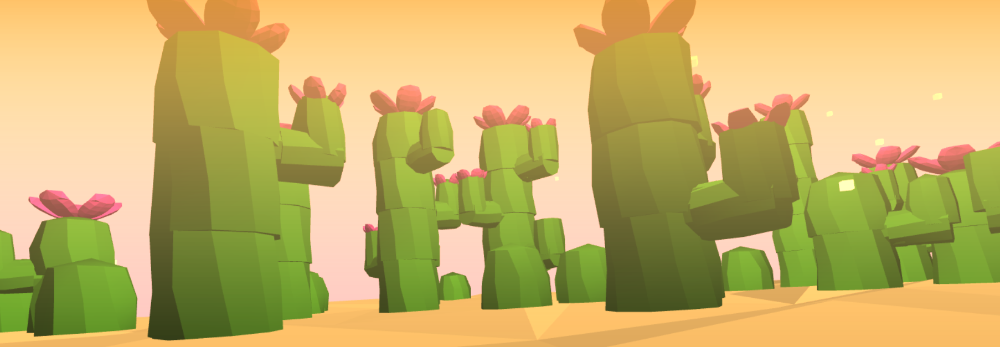
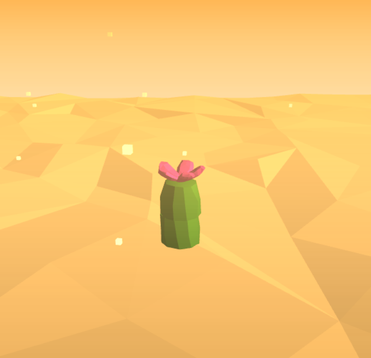
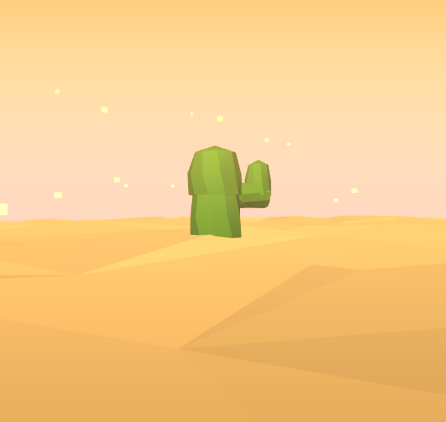
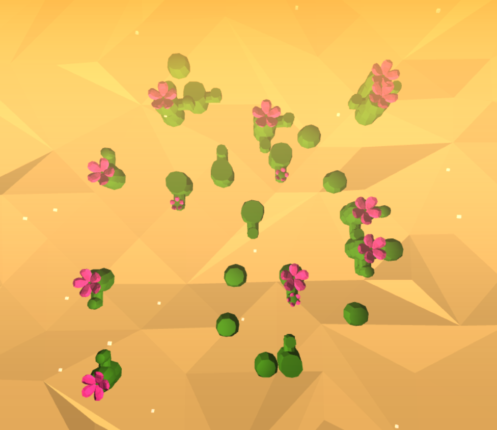
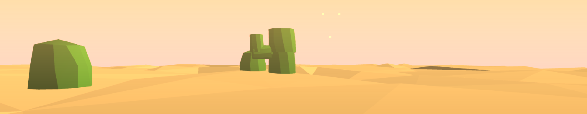
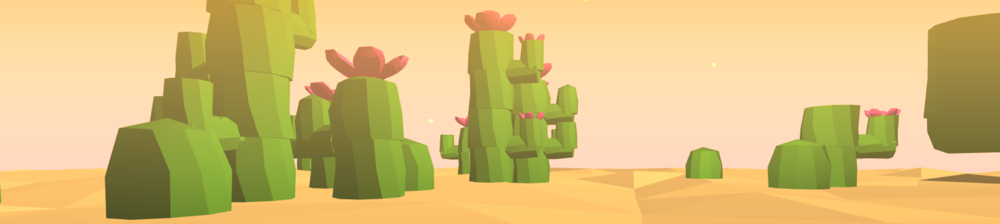

# Homework 4: L-systems

# Low Poly Cactus

Wanru Zhao, 59981278

## Description

Low poly cactus desert. Cactus generated using L-system with random branching, rotation, translation rules. Also did the collision detection to avoid overlap of newly generated units.

### GUI
- Axiom : initial value is X. Rule characters can be used: X, F, E, * (There must be a X in axiom in order to grow, * is flower).
- Iteration: from 0 - 10, initial value is 2. 
- Color: used to change the color of flowers.
- Angle: used to change branching angle.

### Result
Initial 1     | Initial 2 
:-------------------------:|:-------------------------:
    |        

